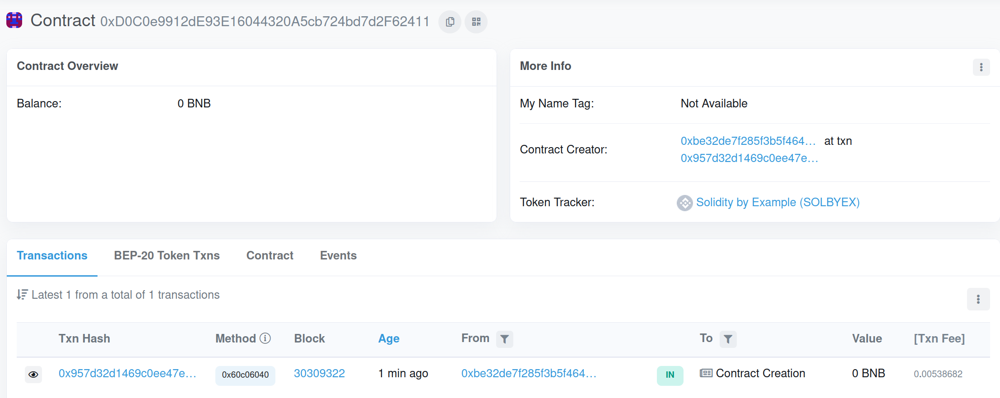
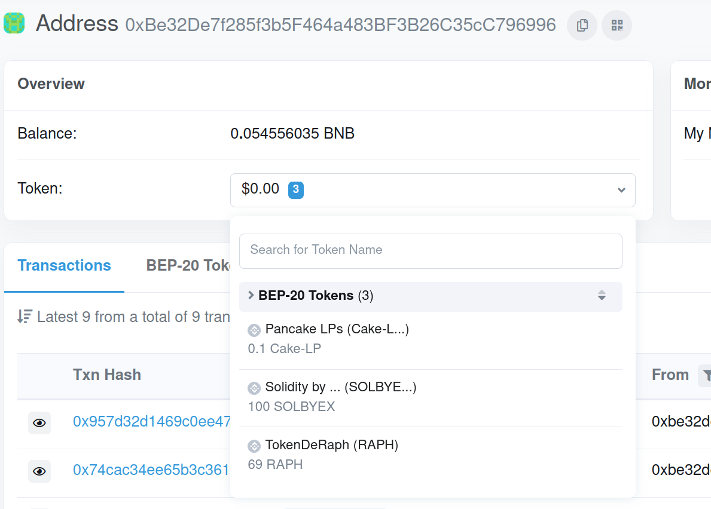
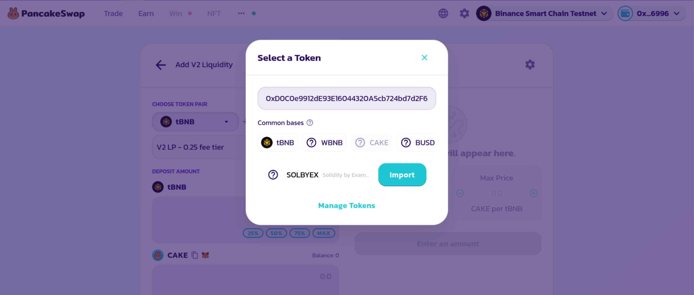
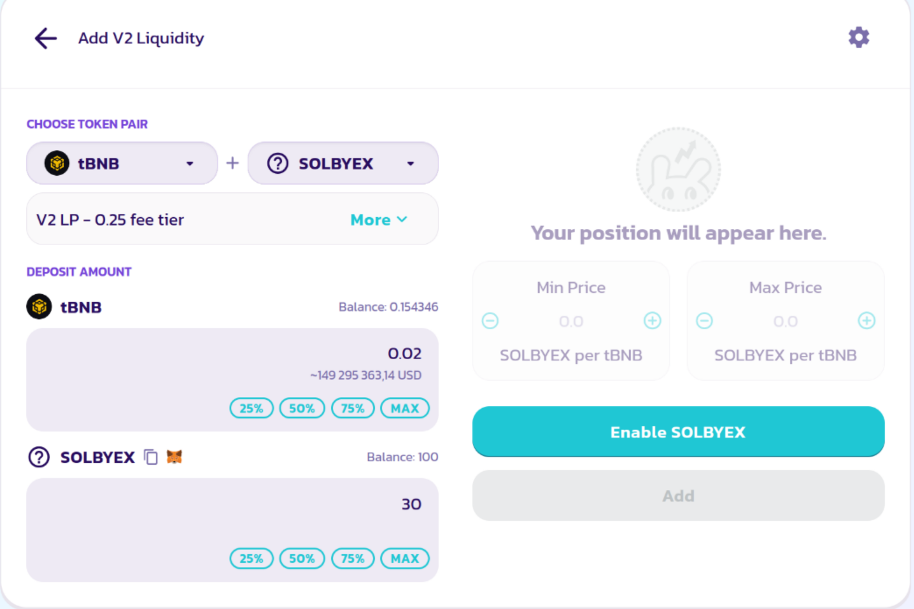

# Créer un ERC-20
Dans le même répertoire que le TD précèdent, créer un nouveau contrat "ERC20.sol" et le fichier de test associé.

Comme indiqué dans le cours, un ERC-20 doit implémenter les fonctions suivantes:

```solidity
function name() public view returns (string)
function symbol() public view returns (string)
function decimals() public view returns (uint8)
function totalSupply() public view returns (uint256)
function balanceOf(address _owner) public view returns (uint256 balance)
function transfer(address _to, uint256 _value) public returns (bool success)
function approve(address _spender, uint256 _value) public returns (bool success)
function transferFrom(address _from, address _to, uint256 _value) public returns (bool success)
function allowance(address _owner, address _spender) public view returns (uint256 remaining)
```

ainsi qu'émettre les évènements suivants:
```
event Transfer(address indexed _from, address indexed _to, uint256 _value)
event Approval(address indexed _owner, address indexed _spender, uint256 _value)
```

## Description des fonctions

##### ``function name() public view returns (string)``
Retourne le nom du token. C'est le nom qui sera affiché sur les explorers.
##### ``function symbol() public view returns (string)``
La fonction symbol doit retourner le symbol du token. Généralement il est composé de trois caractères en majuscule mais il est courant d'en voir quatre ou cinq. Exemple: BNB, ETH, XIV, XRP
##### ``function decimals() public view returns (uint8)``
Decimals est optionnel mais fortement recommendée. Elle indique le nombre de décimales après la virgule maximal qui est accepté. La valeur la plus commune est 19. La plus petite valeur échangeable de votre token sera alors de 0.0000000000000000001 token.
##### ``function totalSupply() public view returns (uint256)``
Indique le nombre total de tokens existant. Elle peut varier au cours du temps.
##### ``function balanceOf(address _owner) public view returns (uint256 balance)``
Retourne la balance de l'adresse indiquée (le nombre de tokens en sa possession).
##### ``function transfer(address _to, uint256 _value) public returns (bool success)``
Transfère ``value`` tokens du compte de l'appelant vers le compte de ``_to``
##### ``function approve(address _spender, uint256 _value) public returns (bool success)``
Autorise ``_spender`` à dépenser ``_value`` tokens de celui qui appelle la fonction
##### ``function transferFrom(address _from, address _to, uint256 _value) public returns (bool success)``
Transfer ``_value`` tokens de ``_from`` vers ``_to``. Pour que le transfer soit possible, ``_from`` doit avoir approuvé (avec ``approve``) l'adresse effectuant la transaction
##### ``function allowance(address _owner, address _spender) public view returns (uint256 remaining)``
Retourne combien ``_spender``  peut dépenser de tokens de ``_owner`` (précedemment autorisé via ``approve``)


## Exercice 1: Déployer un ERC-20 en local
Dans cet exercice nous allons créer votre propre token.

Dans le répertoire de forge, copier le ficher ERC-20.sol dans le dossier src/. Le fichier ERC-20 est disponible sur le github à l'adresse https://github.com/wesraph/td-blockchain-esgi/tree/td-03-creer-un-erc20/ERC20.sol

Vous pouvez modifer les variables "name" et "symbol" par la valeur de votre choix.

### Question
Que fait la fonction `function mint(uint amount) internal` ?

### Exercice

Écrire le test nécessaire pour déployer l'ERC-20 et afficher la balance de l'utilisateur.

Écrire un test effectuant un transfer de 20 tokens vers l'adresse ``0x0000000000000000000000000000000000001000``

## Exercice 2: Déployer un ERC-20 sur le testnet BSC
Dans cet exercice nous allons reprendre le token précedemment créé en local et allons le déployer sur le testnet de Binance Smart Chain.

Forge permet d'automatiser le procédé en utilisant une seul ligne de commande:
``forge create --rpc-url https://data-seed-prebsc-1-s1.binance.org:8545/  --pr
ivate-key VOTRE_CLE_PRIVÉE src/ERC20.sol:ERC20``

Pour obtenir votre clé privée (utilisée pour signer la transaction), suivre la méthode suivante:
https://raw.githubusercontent.com/wesraph/td-blockchain-esgi/td-03-creer-un-erc20/privatekey.mp4

La sortie de la commande doit ressembler au message suivant:
```
[⠒] Compiling...
No files changed, compilation skipped
Deployer: 0xBe32De7f285f3b5F464a483BF3B26C35cC796996
Deployed to: 0xD0C0e9912dE93E16044320A5cb724bd7d2F62411
Transaction hash: 0x957d32d1469c0ee47e4fbd61e157840db8d545822ddc54ee467f1609354dcf8b
```

Attention, il faut que vous disposiez de BNBs de test sur votre adresse !

Sur le site https://testnet.bscscan.com/, entrer l'adresse du "Deployed to" dans la barre de recherche.



### Question
À quoi correspondent "Deployed to", "Deployer" et "Transaction hash" ?

### Exercice
En allant sur la page associée à votre adresse, en cliquant sur le menu déroulant des tokens possédés vous devriez voir 100 de vos tokens.

<p align="center">
  
</p>

Afin de pouvoir utiliser vos tokens, il est nécessaire de les ajouter dans Metamask.

https://github.com/wesraph/td-blockchain-esgi/assets/16212249/7f6dca3b-bf38-440f-8d40-87e8c051783e

### Exercice
En utilisant Metamask, envoyer 1 token à l'adresse ``0x6C750e594ef9A17351a9D3aF8341b59Cc9ed6d9c``.

## Exercice 3: Ajouter un token en liquidité
Lors du projet il sera demandé de disposer d'au moins 1 token de chacun des autres groupes. Heuresement, il existe des protocoles permettant leurs échanges. PancakeSwap est un "fork" d'Uniswap (voir cours) disponible sur le testnet de Binance Smart Chain. Dans cet exercice nous allons mettre en vente notre token.

### Exercice
Se rentre à l'adresse suivante: ``https://pancakeswap.finance/swap?chain=bscTestnet``

Cliquer sur le bouton de connexion "Connect wallet" en haut à droite.

Aller dans la section "Liquidity", puis cliquer sur "Add liquidity".

Nous devons choisir ici quels tokens nous souhaitons mettre en liquidité. Dans notre cas, nous voulons utiliser tBNB ainsi que le token que vous venez de créer. Cliquer sur "CAKE" (le token que l'on veut remplacer) et sélectionner votre token. Votre token ne sera pas disponible dans la barre de recherche, il faut le forcer en entrant directement son adresse puis en cliquant sur "Import".

<p align="center">
  
</p>

Sélectionner "Add v2 liquidity".

Vous pouvez maintenant choisir le montant de tokens que vous voulez vendre. Comme vu dans le cours, le "ratio" entre tBNB et votre token va en définir son prix.

Pour l'exemple, nous mettrons les valeurs 0,02 et 30.

<p align="center">
  
</p>

Finalement, cliquer sur Enable, puis sur Add.

### Questions:
À quel prix (en tBNB) avez vous mis votre token en vente ?

Comment est-il possible d'acheter votre token ?
