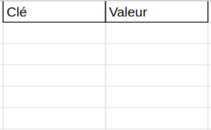
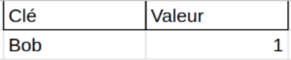
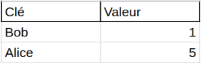

# Mon premier contrat

### Lancer les tests du premier contrat
```
forge test
```

### Questions
- Quel est le chemin (nom du fichier) du smart contract ?
- Quel est le chemin du fichier de test ?

##### Dans le smart contract
Quelle est la spécificité de la variable "number" à la ligne 5 ?

##### Dans le fichier de test
- Que fait la fonction setUp() ?
- Que fait la fonction testIncrement() ?
- A quoi sert "assertEq" ?
- Que fait la fonction testSetNumber ? Pourquoi prend elle un paramètre ?
- Que se passe-t-il si je renomme testIncrement en jeTestIncrement ?

### Exercice
Implémenter la fonction "decrement" répondant au test suivant:
```solidity
function testDecrement() public {
    counter.increment();
    counter.decrement();
    assertEq(counter.number(), 0);
}
```

### Questions
Que se passe-t-il si j'exécute le test suivant ?
```solidity
function testDecrementWithoutIncrement() public {
    counter.decrement();
    assertEq(counter.number(), 0);
}
```
Expliquer la raison du problème.

### Questions
Ajouter le test suivant:
```solidity
function testPrintValue() public {
    counter.increment();
    console.log("The value is:", counter.number());
}
```
Executer le test avec la commande:
```shell
forge test -vv
```
Quelle est la différence avec les tests précédents ?

### Exercice
Créer un nouveau smart contract (Name.sol) validant les tests suivant:
```solidity
// SPDX-License-Identifier: UNLICENSED
pragma solidity ^0.8.13;

import "forge-std/Test.sol";
import "../src/Name.sol";

contract NameTest is Test {
    Name public name;

    function setUp() public {
        name = new Name();
    }

    function testSetName() public {
        name.setName("bob");
        assertEq(name.storedName(), "bob", "failed to store name");
    }
}
```

Attention, pour passer une string dans une fonction, il faut ajouter le terme "memory" après le type.

```solidity
function setName(string memory _name) public {
```

### Exercice
On veut maintenant stocker l'adresse de la dernière personne qui a appelé le contrat. L'adresse de l'appelant peut se récuperer avec ``msg.sender``. Notre propre addresse est disponible via ``address(this)``.

Dans le contrat Name.sol, coder la fonction passant le test suivant:
```solidity
function testSetName() public {
    name.setName("bob");
    assertEq(name.storedName(), "bob");
    assertEq(name.lastCaller(), address(this));
}
```

### Exercice
Solidity permet d'utiliser des maps (comme Javascript ou Python). Pour cela on doit la déclarer de la manière suivante:
```solidity
mapping(address => uint) public counter;
```
Ici counter permet d'associer une adresse à un nombre. Pour écrire dans la map, il suffit d'inclure la clé entre crochets:
```solidity
counter[msg.sender] = 1;
```

Adapter Name.sol pour sauvegarder le nombre de fois où chaque adresse a mis à jour le nom du contrat.

La fonction doit correspondre au test suivant:
```solidity
function testCallsCounter() public {
    name.setName("alice");
    name.setName("bob");
    name.setName("alex");
    assertEq(name.storedName(), "alex");
    assertEq(name.lastCaller(), address(this));
    assertEq(name.callsCounter(address(this)), 3);
}
```

### Exercice supplémentaire sur les mappings
Le mapping permet d'associer une clé à une valeur. Essayons de l'utiliser pour associer une chaine de caractères à un nombre.




Par défaut (en Solidity), si aucune valeur n'est associée à la clé, la valeur retournée sera 0.

Ici si nous cherchons la valeur ``mappingWithString["bob"]``, la valeur sera 0.

Si nous associons une valeur au mot "bob" ``mappingWithString["bob"] = 1;`` nous obtenons le schéma suivant:




Nous pouvons maintenant récuperer cette valeur avec: ``mappingWithString["bob"]``, cela nous retournera 1.
Si nous cherchons une valeur associée à une clé qui n'existe pas, par example ``mappingWithString["alice"]``, la valeur retournée sera 0.

Associons maintenant une valeur à "alice":
``mappingWithString["alice"] = 5;``




Si nous cherchons la valeur associée à "bob" ``mappingWithString["bob"]`` nous aurons toujours la valeur 1. Cependant maintenant si nous cherchons la valeur associée à "alice", ``mappingWithString["alice"]``, nous aurons la valeur 5.

### Questions
On rajoute au **contrat** le mapping suivant:
```
mapping(string => uint) public mappingWithString;
```
Rajouter au contrat une fonction permettant d'écrire dans le mapping. La signature de la fonction est la suivante:
```
function writeIntoTheStringMapping(string memory key, uint256 value) public {

}
```

Pour tester le bon fonctionnement de la fonction, vous pouvez vous aider du test suivant:
```solidity
function testWritingIntoTheTestMapping() public {
    // Write into the test mapping a value
    name.writeIntoTheStringMapping("bob", 123);

    // Let's print the value associated with bob
    console.log(
        "The value associated with bob is",
        name.mappingWithString("bob")
    );
}
```
N'oubliez pas de lancer la commande ``forge test`` avec ``-vv`` pour que les résultats de la commande ``console.log`` s'affichent.

Essayer de rajouter le test ``name.writeIntoTheStringMapping("alice", 5555);`` et observer ce que la console affiche.
Est-ce que ``name.mappingWithString("bob")`` retourne toujours la même valeur ?
Que ce passe-t-il si on rajoute aux tests:
```solidity
console.log(
        "The value associated with bob is",
        name.mappingWithString("alice")
);
 ```

### Exercice
Le constructeur est une fonction appelée lors de la création du contrat et uniquement lors de sa création.
Sa syntaxe est la suivante:
```solidity
constructor() {

}
```
Il est également possible de lui passer des paramètres:
```solidity
constructor(uint256 myparam) {

}
```

L'opération "revert" permet d'annuler la transaction en cours et de revenir à l'état la précédant.
Sa syntaxe est la suivante:
```solidity
require(my_condition, "this is an error message");
```

On pourra l'utiliser de la manière suivante:
```solidity
require(admin == msg.sender, "is not admin");
```

Créer une fonction où seul le créateur du contrat peut mettre à jour la valeur storedName. Elle doit répondre aux tests suivant:
```solidity
function testOnlyOwner() public {
    name.setNameOnlyOwner("bob");

    // Change the caller address to the address
    // 0x0000000000000000000000000000000000000000
    vm.prank(address(0x0000000000000000000000000000000000000000));

    // Tell the VM that we are expecting the call to revert
    // with the error message "only admin"
    vm.expectRevert("only admin");
    name.setNameOnlyOwner("alice");
}
```

Solidity permet de créer des "modifiers" qui sont appelés avant l'exécution de la fonction.
La syntaxe est la suivante:
```solidity
modifier adminOnly() {
    // Code to execute before

    // Tells the compiler to execute the function
    _;
}

function setNameOnlyOwner(string _name) public adminOnly {
    // Code of setNameOnlyOwner
}
```

Remplir le modifier "adminOnly" pour n'autoriser que le créateur du contrat à exécuter la fonction.

### Exercice
Une fonction peut retourner une valeur arbitraire. Pour cela elle doit respecteur la syntaxe suivante:
```
function returnArbitraryValue() public view returns (uint256 _myValue) {
    _myValue = 5;
}
```
Coder une fonction qui retourne le nombre de fois ou "setName" a été appelée multiplié par deux. Elle doit correspondre au test suivant:
```
function testGetCounterTimesTwo() public {
    name.setNameOnlyOwner("bob");
    name.setNameOnlyOwner("alice");
    assertEq(
        name.getNumberOfCallsTimesTwo(),
        name.callsCounter(address(this))*2,
        "returned value must be 2*callsCounter"
    );
}
```

### Exercice
En Solidity, il est possible d'émettre des évenements. Un évenement indique génèralement le bon déroulement d'une opération. Une de ses principales utilités est d'indiquer lorsque qu'un token a été transféré. Cela permet également aux "explorers" de pouvoir analyzer une transaction (voir les transfers etc).

La syntaxe pour créer un type d'évenement est la suivante:
```solidity
event MyEvent(address indexed firstValue, uint256 secondValue);
```

Pour émettre un évenement, il suffit d'appeler la fonction "emit":
```solidity
emit MyEvent(msg.sender, 1234);
```

Le mot clé "indexed" indique une position particulière du paramètre dans l'évenement. Nous y reviendrons plus tard.

Ajouter l'émission d'un évenement du type
``NameUpdated(address indexed updater, string newValue, uint256 updateCount)``
après chaque mise à jour de ``storedValue``

Le test suivant doit réussir:
```solidity
event NameUpdated(address indexed updater, string newValue, uint256 updateCount);

function testEvent() public {
    vm.expectEmit(true, true, true, true);
    emit NameUpdated(address(this), "bob", 1);
    name.setName("bob");
}
```
